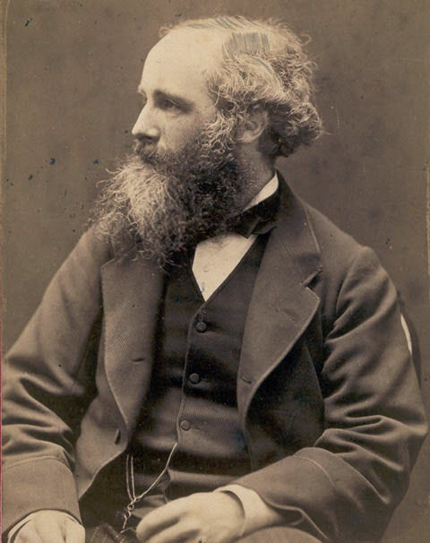

  
  

  <H1> Electrodinámica Clásica </H1>

## Descripción

Este curso, de dos partes (dos trimestres) estudia los principio básicos de la teoría electromagnética. Como ocurre en muchas partes, el curso
utiliza el libro de [J. D. Jackson](https://en.wikipedia.org/wiki/Classical_Electrodynamics_(book)) como texto principallo cual obedece a un interés en , no solo la teoría electromagnética, sino en una necesidad de asegurar que todos los estudiantes graduados que comienzan eestudios, complementen sus conocimientos de base de los métodos clásicos de lafísica matemática.

**Notas:** 

* Para abrir los enlaces en un tabulador alterno, utilice: "Ctrl"+click (lamentablemente, GitHub aún carece de una herramienta natural para lograr esto)* Con el propósito de mantener una notación uniforme, los problemas serán asignados de acuerdo a la notación de la segunda edición del texto ("el Jackson vino tinto")
* Este curso/repositorio está en constucción permanente, regrese de vez en cuando a ver que cambios encuentra.

## Bibliografía para el curso

1. J. D. Jackson. **Classical Electrodynamis**. Wiley. 
2. L. D. LANDAU, E. M. LIFSHITZ.**ELECTRODYNAMICS OF CONTINUOUS MEDIA**. PERGAMON PRESS, 1984
3. Julian Schwinger, Lester L. Deraad Jr., Kimball Milton, Wu-Yang Tsai. **Classical Electrodynamics**, 1999
4. W. .H. Panonfsky, M. Phillips. **Classical Electricity and Magnetism**. 
5. Julius Adams Stratton. **Electromagnetic Theory**.
6. Emile Durand, [Electrostatique](https://archive.org/details/electrostatique0000dura_u0w3) 

## Bibliografía Auxiliar

1. H. W. Wyld, **Mathematical Methods for Physics**, PERSEUS BOOKS, 1999. ISBN 0-7382-0125-1
2. George B. Arfken, Hans J. Weber. **Mathematical Methods for Physicists** (sixth edition). Elsevier, 2005. ISBN: 0-12-059876-0
3. Hans F. Weinberger. **A First Course in Partial Differential Equations with Complex Variables and Transform Methods**
4. Ivar Stakgold, Michael Holst. **Green's Functions and Boundary Value Problems**
5. Philip M. Morse, Herman Feshbach. **Methods of Theoretical Physics**. McGRAW-HILL BOOK COMPANY, 1953{
6. R. Courant, D. Hilbert, **Methods of Mathematical Physics**. Wiley Classics Edition

## Material de Estudio (Apuntes, clases y videos)

[Repaso de Series Fourier](https://github.com/mario-i-caicedo-ai/Introduccion-a-las-Ecuaciones-Diferenciales-Ordinarias/))

[Repaso de Series Fourier](https://github.com/mario-i-caicedo-ai/Series-de-Fourier)

[Semanas 1 y 2] Introducción a la Electrostática. Capítulo I del Texto del Curso.

## Tareas

**Observación: Trate de dar una interpretación física transparente a cada problema que resuelva**

[Semana 1. Tarea 0]. Problemas 1-1 a 1.5 del texto

[Semana 2. Tarea 1]. Problemas 1.6 a 1.13 del texto. Para el problema 12 limítese al caso discreto. Adicionalmente, demuestre lo siguienteÑ Una partícula cargada no puede permanecer en equilibrio estable únicamente bajo la acción de un campo eléctrico. Esto es equivalente al siguiente teorema:
**Maximum principle** Let $f$ be a harmonmic functionm (a solution of the Laplace eqn), if K is a nonempty compact subset of U, then f restricted to K attains its maximum and minimum on the boundary of K. If U is connected, this means that f cannot have local maxima or minima, other than the exceptional case where f is constant.
[Semana 3. Tarea 2] Completar los Problemas del Capítulo I del texto.

